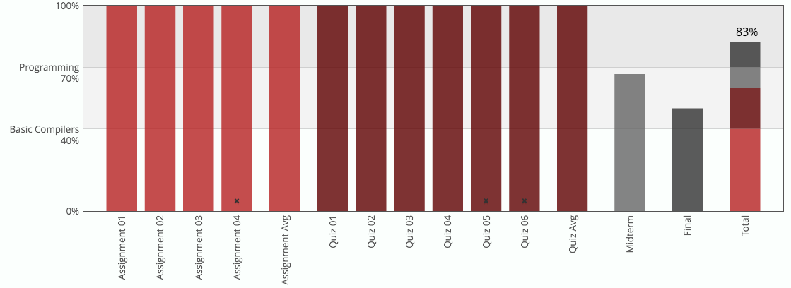

# Stanford CS143 Compilers

## Introduction

- **Stanford CS143 Compilers**
	- Instructor: Alex Aiken
	- Website
		- (OCW, Spring 2014) [**Stanford Online Compilers (self-paced)**](https://lagunita.stanford.edu/courses/Engineering/Compilers/Fall2014/courseware)
		- (OCW, Spring 2014) [**Coursera Compilers**](https://www.coursera.org/course/compilers)
		- [**Stanford CS143 Compilers**](http://web.stanford.edu/class/cs143/)
		- If you get stuck, you can find more discussion posts in Coursera than in Stanford Online.
- Prerequisites: **C++ or Java Experience**
- Meterials 
	- [x] **Video + Script**
	- [x] **Quiz**
		- [x] **Officail Solution**
		- [09-08 in-video quiz wrong answer](https://lagunita.stanford.edu/courses/Engineering/Compilers/Fall2014/discussion/forum/i4x-Engineering-Compilers-Lectures-Fall2014/threads/5473bbd457f960b95d0011f1#)
	- [x] **Assignment**
		- [**Review**](PA/PA2_Lexer) PA01: Lexical Analysis: `PA/PA2_Lexer $ make lexer`
		- [**Review**](PA/PA3_Parser) PA02: Parsing: `PA/PA3_Parser $ make parser`
		- [**Review**](PA/PA4_Semantic) PA03: Semantic Analysis and Type Checking: `PA/PA4_Semantic $ make semant`
		- [**Review**](PA/PA5_CodeGen) PA04: Code Generation: `PA/PA5_CodeGen $ make cgen`
		- **Autograder**
	- [x] **Notes**
		- [**Week01**](Notes/Week01.ipynb)
		- [**Week02**](Notes/Week02.ipynb)
		- [**Week03**](Notes/Week03.ipynb)
		- [**Week04**](Notes/Week04.ipynb)
		- [**Week05**](Notes/Week05.ipynb)
		- [**Week06**](Notes/Week06.ipynb)
		- [**Week07**](Notes/Week07.ipynb)
		- [**Week08**](Notes/Week08.ipynb)
		- [**Week09**](Notes/Week09.ipynb)
		- [**Week10**](Notes/Week10.ipynb)
	- Remarks
		- The four assignments can be assembled to a compiler.
		- The Deduceit Assignment in Coursera is down.
		- There're [**Written Assignments**](http://web.stanford.edu/class/cs143/) in Spring 2016.
- Recommanded Textbooks (No textbook is required.)
	- **Compilers: Principles, Techniques, and Tools** (CPTT, aka "The Dragon Book") by Aho, Lam, Sethi, and Ullman, 2ed.
	- **Engineering a Compiler** (EC) by Cooper and Torczon, 2ed
	- **Modern Compiler Implementation** (MCI) by Appel, with Palsberg 
		- Note: There are versions of this book tailored to C and Java, as well as ML.

## Assignments

You can't build on Mac OS X.

You can download the virtual box on the course site or use the **experimental** [**Dockerfile**](Dockerfile).

1. Create a directorial and put the dockerfile into it.
2. Download the Docker images: `docker build -t stanford-compilers-docker ./`
3. Create a data volume and run it: `docker run -it -v data-volumes:/home/compilers/cool --name container1 stanford-compilers-docker`

## Syllabs

- Introduction
- The Cool Programming Language
- Lexical Analysis
- Finite Automata
- Parsing
	- Top-Down Parsing
	- Bottom-Up Parsing I + II
- Semantic Analysis and Type Checking
- Cool Type Checking
- Runtime Organization
- Code Generation
- Operational Semantics
- Local Optimization
- Global Optimization
- Register Allocation
- Garbage Collection
- Java
